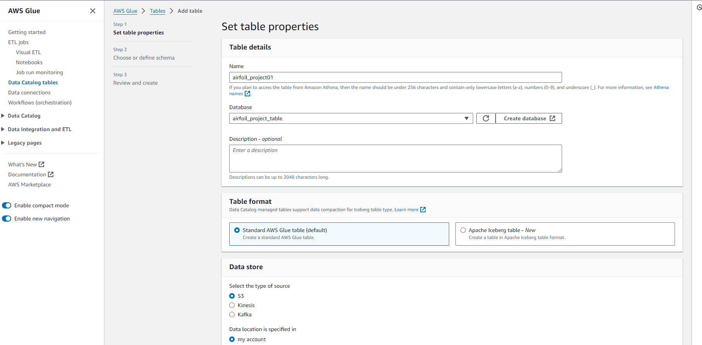

# Machine-Learning-Pipeline-using-AWS-Glue-S3-EMR-SageMaker-Athena

 

 
 Build an end-to-end Machine Learning pipeline using AWS Glue, Amazon S3, Amazon EMR Amazon SageMaker and Amazon Athena

In this project, we embark on an exciting journey to build an end-to-end pipeline based on NASA Airfoil Self Noise  dataset.
Our cutting-edge pipeline will seamlessly integrate several state-of-the-art technologies, creating a harmonious symphony of data processing and machine learning. AWS Glue,a serverless extract-transform-load (ETL) service will be used to orchestrate the data flow, ensuring efficient and reliable data transformations. Amazon SageMaker based on EMR cluster will be used to train and deploy sophisticated predictive models.

## Requirements

Before Starting this guide, you will need:

- An AWS account (if you don't yet have one, please create one and [set up your environment](https://aws.amazon.com/getting-started/guides/setup-environment/))
- An IAM user that has the access to create AWS resources.
- Provided CloudFormation template
- Basic understanding of Python and apache spark 

## Use case and problem statement
A data engineer at an aeronautics consulting company need to build data pipeline for data scientist team. The company prides itself in being able to efficiently design airfoils for use in planes and sports cars. Data scientists in the office need to work with different algorithms and data in different formats. While they are good at Machine Learning, they count on data engineer to be able to do ETL jobs and build ML pipelines. 

In this project we will use the modified version of the NASA Airfoil Self Noise dataset. The dataset will be used, by dropping the duplicate rows, removing the rows with null values and building an ML pipeline to create a model that will predict the SoundLevel based on all the other columns. In the end the model will be evaluated and persisted into amazon s3 bucket for ready deployment.

Table of Contents
=================
[1. Project architecture](#project-architecture)

[2. Create S3 buckets ](#create-s3-buckets)

[3. Create sageMaker-EMR cluster ](#create-sageMaker-EMR-cluster)

[4. Create Glue job for extracting and storing raw data including data Catalog](#create-glue-job-for-extracting-and-storing-raw-data)

[5. Analyze Raw Data using Athena ](#Analyze-Raw-Data-using-Athena)

[6. Machine Learning  ](#machine-learning)

[7. Machine Learning  model persistence ](#machine-learning-model-persitence)

[8. Conclusion ](#conclusion)

[9. Appendix ](#appendix)

## 1. Architecture

To implement this data pipeline, we will use a provided CloudFormation `in us-east-1` [here ](https://us-east-1.console.aws.amazon.com/cloudformation/home?region=us-east-1#/stacks/quickcreate?templateURL=https://aws-blogs-artifacts-public.s3.amazonaws.com/artifacts/astra-m4-sagemaker/end-to-end/CFN-SagemakerEMRNoAuthProductWithStudio-v3.yaml) 
 with `Amazon SageMaker Studio` which is the first fully integrated development environment (IDE) for machine learning (ML). It provides a single,web-based visual interface where we can perform all ML development steps, including preparing data,training and deploying models. And some resources such as networking, EMR clusters are included in provided template. We are going to use Aws Glue to perform ETL the input and unprocessed data  and store the result in Amazon S3 Bucket.

 

## 2. Create S3 buckets

From aws console, create bucket and give the name `ml-project01` as below and create inside the bucket 3 sub-folders named `app` , `athena-results` and `final-data`

 

## 3. Create sageMaker-EMR cluster

Make sure you are in us-east-1 region in your aws management console and click on provided templated to create sageMaker-EMR cluster and other ressources such networks, service role, ...
Just give a name to the stack and create the stack as below.

 

## 4. Create Glue job and data Catalog.

**Create a Role for Glue to have proper permissions**
1. Click on IAM from the list of all services. This will bring you to the IAM dashboard page.
2. Click Roles on the left hand panel and then click Create role
3. Select Glue
   
 

 From aws management console nivigate to `aws glue`.
 Create jobs by using visual ETL as below.

 

 

Create glue ETL by selecting the features to be used.

 

Automate the data processing pipeline using Glue Workflow

Create glue catalog for data to be analyzed using athena as below

 

After completing all jobs , in final data sub folder in S3, bucket we can verify our data in parquet format as below.

## 5. Analyze Raw Data using Athena
From AWS Management Console. Click on Athena from the list of all services. This will bring you to the Amazon Athena dashboard page.
Use the code below  to analyze data.

``SELECT * FROM "airfoil_project_table"."airfoil_project01" limit 5;``

## 6  Machine Learning 

In aws management console, open sageMaker and go to sageMaker Domain.
We can see that our Studio domain has been created.

**Start the notebook and kernel** 

Just click on domain name to open the studio.
In Studio, choose the File menu, then choose New and Notebook and select the SparkMagic Image and PySpark kernel. 

##  7. Machine Learning  model persistence

Model persistence is the ability to save and load the machine learning model. It is desirable to have a way to persist the model for future use without having to retrain.

 

 

TO BE CONTINUED ...

## 8. Conclusion

**Clean up the end-to-end stack**

After completing the following steps to clean up the resources deployed for this solution:

1. Delete your EMR cluster, as shown in the previous section.
2. On the Studio console, choose your user name .
3. Delete all the apps listed under Apps by choosing Delete app.
4. Wait until the status shows as Completed.
Next, you delete your Amazon Elastic File System (Amazon EFS) volume associated with domain provisioned.

5. On the Amazon EFS console, delete the file system that SageMaker created.
You can confirm it’s the correct volume by choosing the file system ID and confirming the tag is `ManagedByAmazonSageMakerResource`

Finally, you delete the CloudFormation template.

6. On the AWS CloudFormation console, choose Stacks.
7. Select the stack you deployed for this solution.
Choose Delete.

 

## 9. Appendix 

1. [Create and manage Amazon EMR Clusters from SageMaker Studio to run interactive Spark and ML workloads – Part 1](https://aws.amazon.com/blogs/machine-learning/part-1-create-and-manage-amazon-emr-clusters-from-sagemaker-studio-to-run-interactive-spark-and-ml-workloads/)
2. [Discover Amazon EMR clusters from SageMaker Studio Classic](https://docs.aws.amazon.com/sagemaker/latest/dg/discover-emr-clusters.html)
3. 
